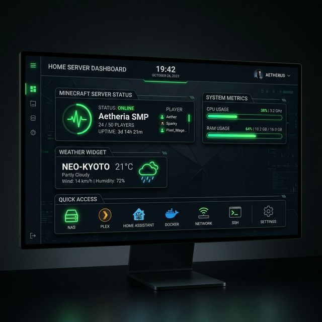

# 🖥️ Home Dashboard

A premium, modern dashboard designed for controlling your personal infrastructure. Manage your **Minecraft** server, monitor **system metrics**, and access all your **self-hosted services** from a single, high-performance interface.



## ✨ Features

- 🎮 **Minecraft Control Center**: One-click Start/Stop for your game server with real-time status indication.
- 📊 **Live System Metrics**: Monitor CPU load, RAM usage, and system uptime with sleek progress bars.
- 📜 **Integrated Logs**: Real-time console logs from your server, formatted for readability.
- 🔗 **Quick Access**: Smart launchpad for your favorite self-hosted apps like CasaOS, Immich, and Nextcloud.
- ☁️ **Weather & Time**: Dynamic weather widget and a clean, high-precision clock system.
- 🛡️ **IP Security**: All sensitive domains and IPs are managed securely via environment variables.
- 🌑 **Cyberpunk Aesthetic**: High-contrast dark mode with vibrant accents and glassmorphism.

## 🚀 Quick Start

### 1. Requirements
- Node.js (Latest LTS)
- npm or yarn

### 2. Installation
Clone the repository and install dependencies:

```bash
git clone https://github.com/your-username/home-dashboard.git
cd home-dashboard
npm install
```

### 3. Configuration
Copy the `.env.example` file to `.env` and fill in your details:

```bash
cp .env.example .env
```

Edit the `.env` file:
```ini
VITE_DASHBOARD_DOMAIN=yourdomain.com
VITE_TAILSCALE_IP=100.x.y.z
VITE_DEFAULT_IP=192.168.1.1
PORT=3001
```

### 4. Running the Dashboard
Start both the API server and the frontend development server:

```bash
# Start the backend API
npm run server

# In a new terminal, start the frontend
npm run dev
```

Visit `http://localhost:5173` to view your dashboard.

## 🏗️ Architecture

- **Frontend**: [React 19](https://reactjs.org/), [Vite 8](https://vitejs.dev/), [Lucide](https://lucide.dev/) for icons.
- **Backend**: [Express 5](https://expressjs.com/), [SQLite](https://www.sqlite.org/).
- **Styling**: Vanilla CSS with modern flexbox and grid layouts.
- **System Monitoring**: [System Information](https://systeminformation.io/).

## 🛠️ Customization

Customize the dashboard by adding or removing services in `server.cjs` or using the **Settings** modal (⚙️) located at the top-right of the interface.

---

Made with ❤️ by [Your Name](https://github.com/your-username)
